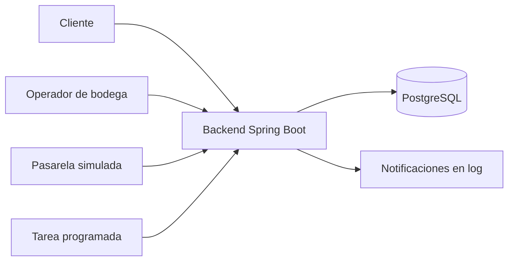
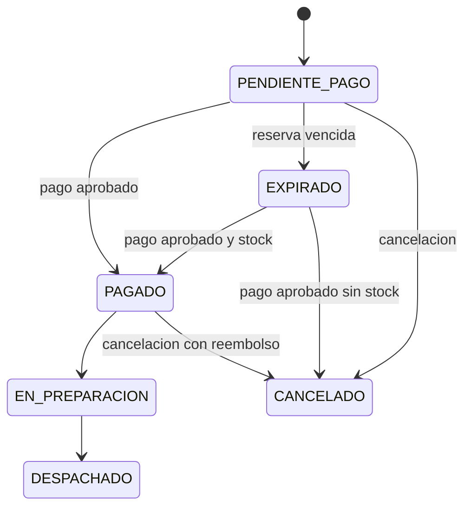

# Caso 4: Pedidos de una tienda en linea

Monolito modular Spring Boot para pedidos recibidos por web o redes sociales. Incluye reserva temporal de inventario, confirmacion de pago simulada, reembolso automatico, preparacion, despacho, historial, vencimiento programado y metricas.

## Alcance

- Canales: `WEB`, `INSTAGRAM`, `FACEBOOK` y `WHATSAPP`.
- Reserva todo o nada al crear el pedido; el stock fisico baja al despachar.
- Idempotencia mediante `Idempotency-Key` para pedidos y confirmaciones de pago.
- Pago, notificaciones y envio son simulados; las notificaciones aparecen en el log.
- No incluye autenticacion, carrito, frontend, transportista real, devoluciones ni firma de webhook.

## Arquitectura

Es un monolito modular con PostgreSQL. Inventario usa bloqueos pesimistas en un orden fijo para evitar sobreventa y deadlocks. Una tarea programada libera reservas vencidas; no se usa RabbitMQ porque no hay una carga asincrona que lo justifique en este caso.





## Ejecucion

Requiere Docker y Docker Compose:

```bash
docker compose up --build -d
docker compose ps
docker compose logs -f backend
docker compose down
```

La API queda en `http://localhost:8080`. En Codespaces se puede abrir desde el panel Ports. Swagger esta disponible en `/swagger-ui/index.html`.

## Prueba rapida

Productos iniciales: `CAM-001` (10), `TAZ-001` (5) y `ESC-001` (1).

```bash
curl -s -X POST http://localhost:8080/api/pedidos \
  -H "Content-Type: application/json" -H "Idempotency-Key: ped-001" \
  -d '{"clienteEmail":"ana@correo.com","canal":"INSTAGRAM","items":[{"sku":"CAM-001","cantidad":2}]}'
```

Usa el `id` y `referenciaPago` recibidos para confirmar el pago:

```bash
curl -s -X POST http://localhost:8080/api/pagos/confirmacion \
  -H "Content-Type: application/json" -H "Idempotency-Key: evt-001" \
  -d '{"pedidoId":1,"resultado":"APROBADO","referencia":"PAY-XXXXXXXX"}'
```

Despues puedes llamar a `POST /api/pedidos/{id}/preparar`, `POST /api/pedidos/{id}/despachar?guia=ABC123`, consultar `GET /api/pedidos/{id}` y revisar `GET /api/metricas`.

## Caso de pago tardio

Configura `RESERVA_MINUTOS=1` en `.env`, recrea el backend, deja vencer un pedido y ocupa luego la unidad disponible con otro pedido. Si confirmas el pago del primero cuando ya no queda stock, pasa a `CANCELADO` con motivo `SIN_STOCK_TRAS_PAGO` y el pago queda `REEMBOLSADO`.

## Decisiones y riesgos

La reserva temporal evita la sobreventa y el bloqueo de pedido serializa eventos concurrentes. Si un reembolso externo falla, debe registrarse y reintentarse mediante una futura cola o conciliacion. La v1 no valida firma del webhook ni compara el monto recibido con el total del pedido.