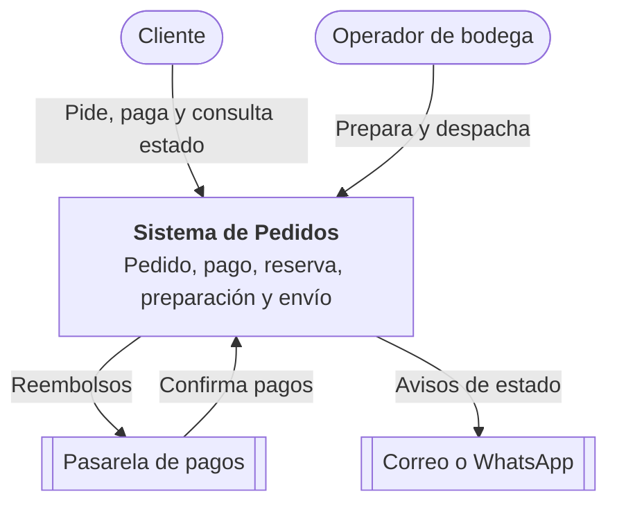
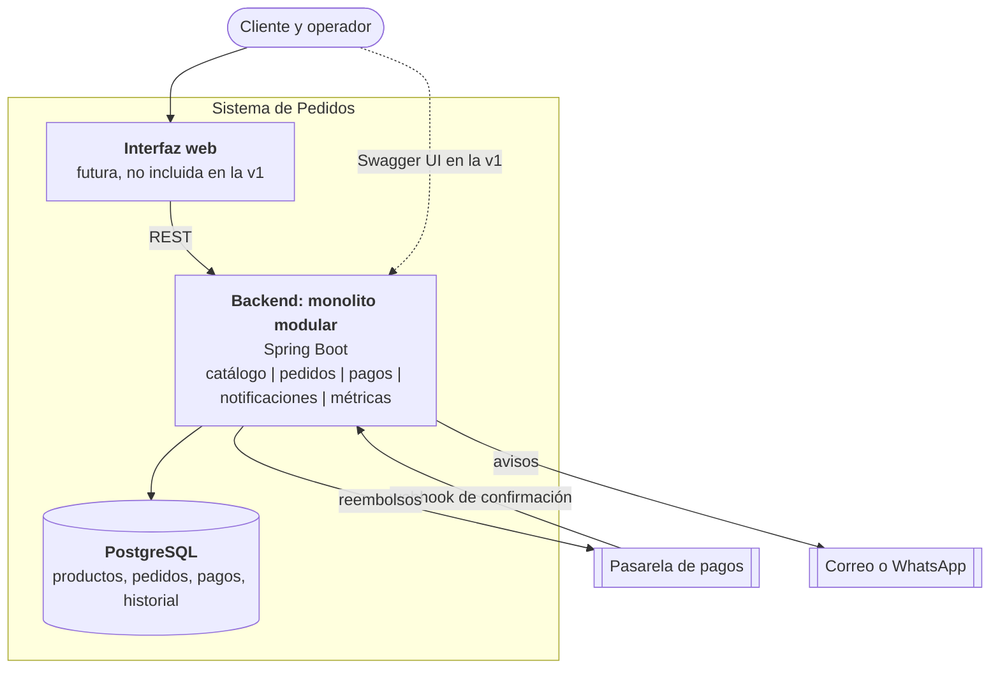
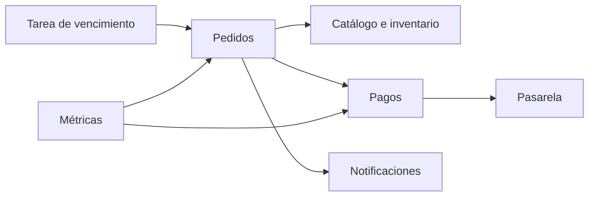
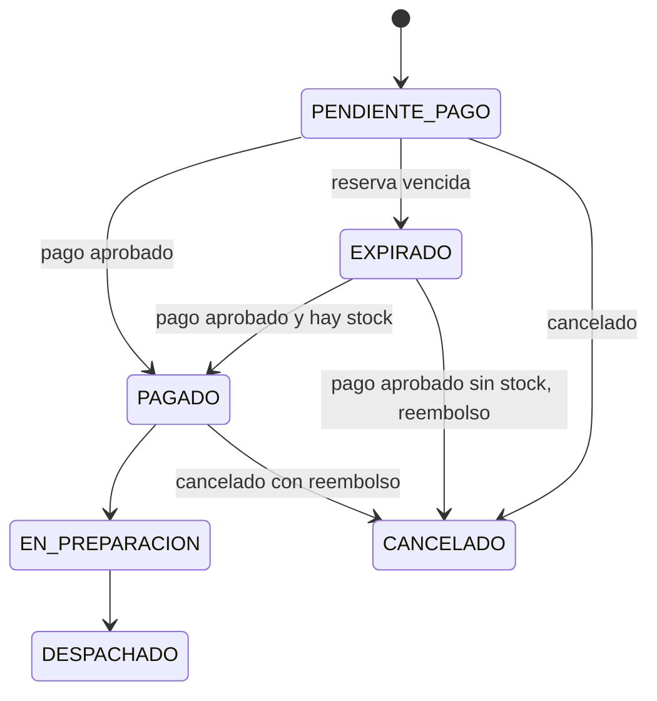
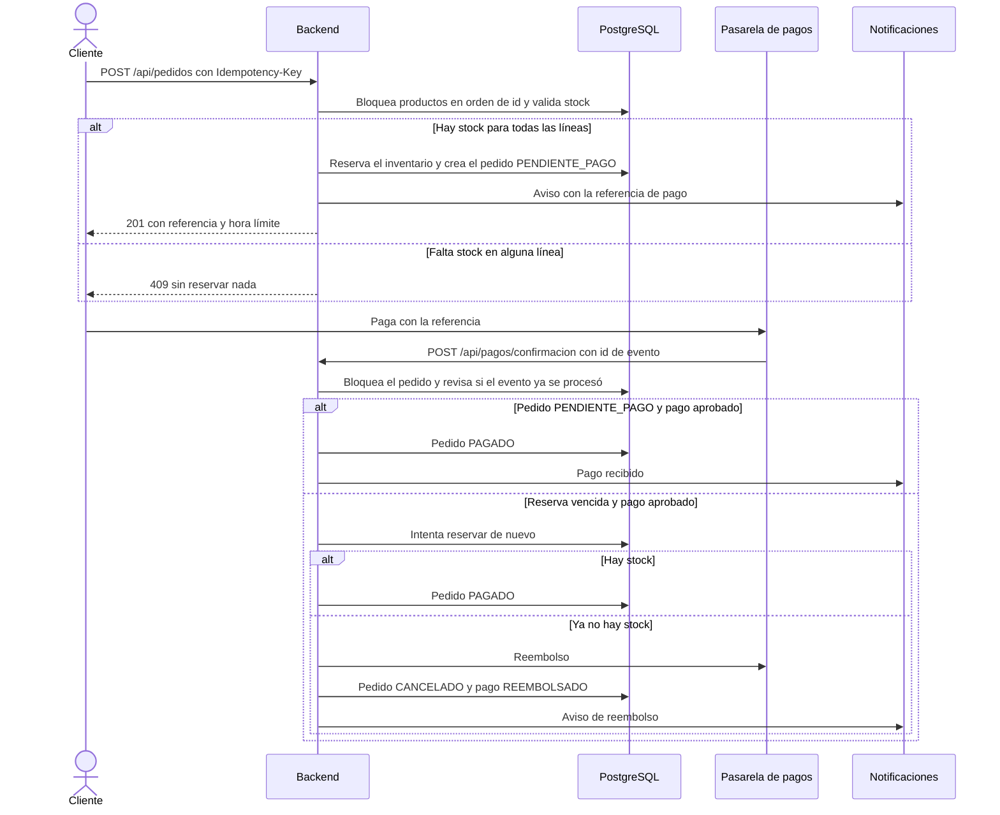

# Caso 4 — Pedidos de una tienda en línea

Sistema para una tienda que vende por web y redes sociales y necesita controlar cada pedido desde que se confirma hasta que se despacha: pago, reserva de inventario, preparación y envío.

## 1. Objetivo, actores y alcance

**Objetivo:** que ningún pedido se venda sin stock, que ningún cliente pague dos veces o pierda dinero si algo falla, y que cada pedido tenga un estado claro y trazable.

| Actor | Rol |
|---|---|
| Cliente | Hace el pedido (web o red social), paga y consulta el estado |
| Operador de bodega | Prepara y despacha los pedidos pagados |
| Pasarela de pagos | Sistema externo que cobra y avisa el resultado |
| Servicio de notificaciones | Avisa al cliente cada cambio de estado |

**Dentro del alcance:** creación de pedido, reserva de inventario con vencimiento, confirmación de pago, cancelación con reembolso, preparación, despacho, estado visible para el cliente y métricas.

**Fuera del alcance (v1):** carrito persistente, catálogo administrable, envío real con transportista, devoluciones, impuestos, autenticación y frontend.

## 2. Requisitos

**Funcionales**
- RF1. Crear un pedido de uno o más productos desde cualquier canal (WEB, INSTAGRAM, FACEBOOK o WHATSAPP).
- RF2. Reservar el inventario de todo el pedido o ninguno, con tiempo límite de pago.
- RF3. Recibir la confirmación de pago y avanzar el pedido.
- RF4. Si el pago se aprueba pero ya no hay stock, reembolsar y cancelar.
- RF5. Cancelar un pedido (con reembolso si ya estaba pagado) mientras no esté en preparación.
- RF6. Preparar y despachar el pedido, descontando el stock físico al despachar.
- RF7. Informar al cliente el estado y el historial del pedido.
- RF8. Liberar automáticamente las reservas que vencen sin pago.

**Calidad**
- Consistencia: nunca se vende más de lo que hay (sin sobreventa), ni siquiera con pedidos simultáneos.
- Idempotencia: reintentar crear, pagar, cancelar, preparar o despachar no duplica efectos.
- Trazabilidad: cada cambio de estado queda en un historial de solo inserción.
- Disponibilidad: una caída de las notificaciones no bloquea el pedido.
- Rendimiento: creación de pedido con p95 menor a 800 ms.
- Evolución: módulos con límites claros para separarlos si el volumen crece.

## 3. Diagramas C4

### Nivel 1: Contexto



### Nivel 2: Contenedores



### Módulos internos



### Estados del pedido



## 4. Flujo de una operación crítica: del pedido al pago



## 5. Decisiones y stack

**¿Cuándo se reserva el inventario?** Al confirmar el pedido, antes del pago, durante un tiempo límite (15 minutos en la configuración por defecto). Así no se vende lo que no existe. Si el pago no llega, una tarea programada libera la reserva y el pedido pasa a `EXPIRADO`. El **stock físico solo baja al despachar**.

**¿Qué ocurre si el pago se aprueba pero falla la reserva?** Esto pasa cuando el pago llega después de que la reserva venció y otro cliente se llevó el stock. El sistema intenta reservar de nuevo. Si no hay stock, reembolsa el pago completo por la pasarela, cancela el pedido con motivo `SIN_STOCK_TRAS_PAGO`, avisa al cliente y deja todo en el historial.

**¿Cómo se informa al cliente del estado?** Con `GET /api/pedidos/{id}`, que devuelve el estado y la línea de tiempo, y con avisos en cada cambio (en la v1 simulados en el log).

**¿Qué operaciones son idempotentes?**

| Operación | Cómo se garantiza |
|---|---|
| Crear pedido | Header `Idempotency-Key` con restricción UNIQUE. El reintento devuelve el mismo pedido |
| Confirmación de pago | Id de evento UNIQUE y, además, la referencia de pago ya procesada |
| Cancelar | Si ya está cancelado o expirado, no cambia nada |
| Preparar y despachar | Si ya están en ese estado o más avanzados, no cambian nada |
| Vencer reserva | Solo actúa si el pedido sigue `PENDIENTE_PAGO` y ya venció |

**¿Qué componentes podrían separarse si crece el volumen?**

| Componente | Por qué separarlo |
|---|---|
| Inventario | Es el punto más disputado: concentra bloqueos y concurrencia |
| Pagos | Integración externa con su propio ritmo y reintentos |
| Notificaciones | Tarea asíncrona sin efecto sobre la consistencia |
| Despacho y envíos | Cambia por transportista y tiene otro equipo operativo |

| Tecnología | Justificación |
|---|---|
| Spring Boot (Java 21) | Estándar del curso, monolito modular simple |
| PostgreSQL | Transacciones y bloqueo de filas para evitar sobreventa |
| REST + OpenAPI (Swagger UI) | Contrato claro y pruebas manuales sin frontend |
| Docker Compose | Entorno reproducible en Codespaces |
| Tarea programada | Suficiente para vencer reservas sin infraestructura extra |
| RabbitMQ | No se usa todavía: no hay tareas asíncronas ni integraciones que lo justifiquen |

## 6. ADR

### ADR-001 (arquitectónica): Monolito modular con reserva temporal y compensación
- **Estado:** aceptada
- **Contexto:** hay que coordinar inventario, pago y despacho. Un fallo a la mitad (pago aprobado sin stock) no puede dejar dinero ni inventario en un estado incorrecto.
- **Decisión:** un monolito modular con reserva de inventario con vencimiento al confirmar el pedido, y compensaciones explícitas (liberar la reserva o reembolsar) cuando una etapa falla.
- **Consecuencias:** consistencia simple dentro de una sola base de datos, y los estados intermedios (`EXPIRADO`, `SIN_STOCK_TRAS_PAGO`) quedan visibles. Costo: las compensaciones deben diseñarse y probarse caso por caso.
- **Alternativas descartadas:** descontar el stock recién al pagar (permite sobreventa) y microservicios con transacciones distribuidas (complejidad sin beneficio actual).

### ADR-002 (tecnológica): PostgreSQL con bloqueo de filas e idempotencia por claves únicas, sin broker
- **Estado:** aceptada
- **Contexto:** pedidos simultáneos compiten por el mismo stock y los clientes y la pasarela reintentan.
- **Decisión:** bloquear los productos con `SELECT ... FOR UPDATE` siempre en el mismo orden, bloquear el pedido al procesar eventos, y usar claves únicas (`Idempotency-Key` y evento de pago). No se agrega RabbitMQ.
- **Consecuencias:** sin sobreventa y sin duplicados por diseño, con pocos componentes. Costo: el bloqueo serializa pedidos del mismo producto, aceptable por ahora.

## 7. Riesgos

| Riesgo | Mitigación |
|---|---|
| Sobreventa o deadlocks por pedidos simultáneos | Bloqueo pesimista con orden fijo por id, reserva todo o nada y prueba de concurrencia |
| El reembolso falla después de un pago aprobado sin stock | Registrar el evento, alertar y reintentar. A futuro, cola con reintentos y conciliación diaria contra la pasarela |
| Confirmaciones de pago duplicadas o falsificadas | Idempotencia por evento y por referencia. A futuro, verificar la firma del webhook y la coincidencia del monto |

**Limitación conocida:** la v1 no verifica la firma del webhook ni compara el monto pagado con el total.

## 8. Métricas

**Negocio:** tiempo entre la compra y el despacho (promedio en minutos). Complementarias: pedidos completados, cancelaciones y errores de pago, disponibles en `GET /api/metricas`.

**Técnica:** latencia p95 de `POST /api/pedidos` (menor a 800 ms). Complementaria: reservas vencidas, que indican abandono o pagos lentos.

---

## Estado de la implementación

| Componente | Estado |
|---|---|
| Reserva de inventario, confirmación de pago idempotente, reembolso automático, cancelación, preparación, despacho, historial, vencimiento de reservas, métricas | Implementado |
| Pasarela de pagos y notificaciones | Simuladas (`PasarelaSimulada` y `Notificador`) |
| Autenticación, carrito, frontend, envío real, devoluciones, firma del webhook | No incluido |

## Cómo ejecutar

```bash
docker compose up --build -d
docker compose ps
docker compose logs -f backend
docker compose down
```

- En Codespaces abre el panel **Ports** y haz clic en el globo del puerto 8080.
- La raíz `/` muestra enlaces. Swagger UI: `/swagger-ui/index.html`. Salud: `/api/health`.
- Para la demo, la confirmación de pago se simula con `POST /api/pagos/confirmacion` (header `Idempotency-Key` con el id del evento).
